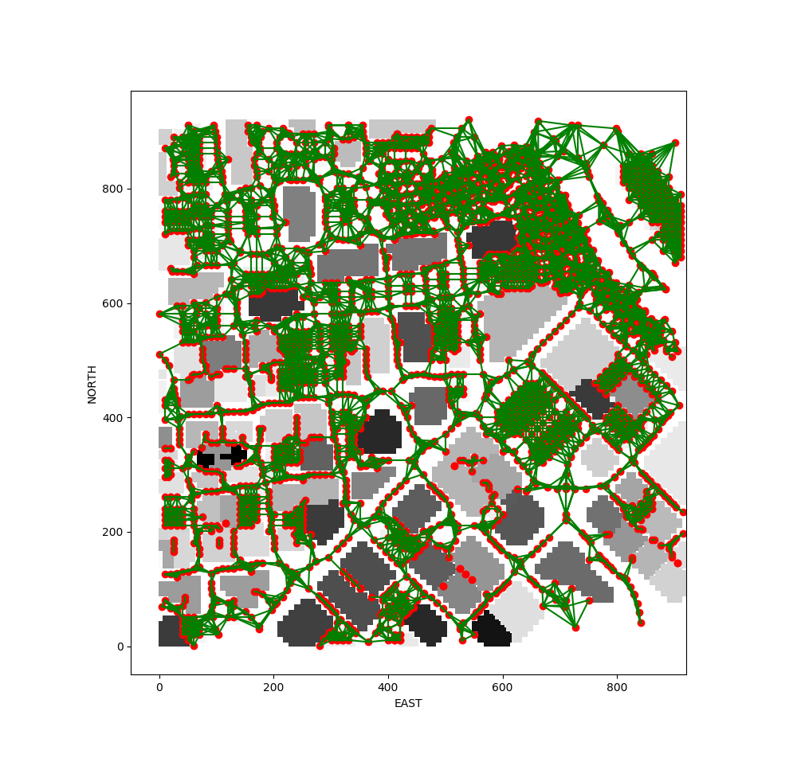
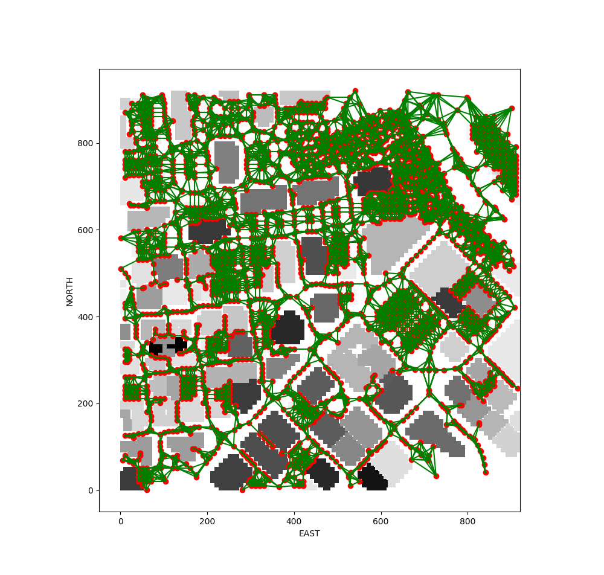

## Project: 3D Motion Planning


---

# Required Steps for a Passing Submission:
1. Load the 2.5D map in the colliders.csv file describing the environment.
2. Discretize the environment into a grid or graph representation.
3. Define the start and goal locations.
4. Perform a search using A* or other search algorithm.
5. Use a collinearity test or ray tracing method (like Bresenham) to remove unnecessary waypoints.
6. Return waypoints in local ECEF coordinates (format for `self.all_waypoints` is [N, E, altitude, heading], where the drone’s start location corresponds to [0, 0, 0, 0].
7. Write it up.
8. Congratulations!  Your Done!

## [Rubric](https://review.udacity.com/#!/rubrics/1534/view) Points
### Here I will consider the rubric points individually and describe how I addressed each point in my implementation.  

---
### Writeup / README

#### 1. Provide a Writeup / README that includes all the rubric points and how you addressed each one.  You can submit your writeup as markdown or pdf.

You're reading it! Below I describe how I addressed each rubric point and where in my code each point is handled.

### Explain the Starter Code

#### 1. Explain the functionality of what's provided in `motion_planning.py` and `planning_utils.py`
These scripts contain a basic planning implementation that includes a class inheriting from udacidrone.Drone super class.

The main point about this class is that it is based on Event Driven Programming, a programming paradigm in which the flow of execution is determined by external events rather than a pre-defined sequence of steps. For doing so, it registers a few callbacks inside `__init__` function:
- local_position_callback: event fired when the local position of the Drone has changed.
- velocity_callback: event fired when the velocity of the Drone has changed.
- state_callback: event fired when the state of the Drone has changed.

With the help of the states and the transitions between them, we will control the Drone:
1. MANUAL. Manual state, no planner is being involved in here.
2. ARMING. The Drone is armed and ready.
3. TAKEOFF. The Drone is taking off the ground to reach the desired height.
4. WAYPOINT. Once at the desired height, the Drone will follow the waypoints we command. This is actually where the real planning is going on.
5. LANDING. Arrival at the final destination and ready to land.
6. DISARMING. Drone has landed and disarms.

Here is a visual of the waypoints planned at the `motion_planning.py` 

### Implementing Your Path Planning Algorithm

### 0. Preflight step: precompute a flying node graph
We precompute a flying node graph, from the grid data, for later used when finding a path.

#### Voronoi graph: [notebook](./research_voronoi.ipynb)
- Original Voronoi graph (k=5)
  - Graph nodes:  3672
  - Graph edges: 16830
  - Grid dimensions:  (921, 921)


- Removing not connected subgraphs:
  - Graph nodes:  3622
  - Graph edges: 16762
  - Grid dimensions:  (921, 921)

- Cull nodes:
  - Graph nodes:  3605
  - Graph edges: 16734
  - Grid dimensions:  (921, 921)


- A* test:


#### Other approaches researched
- Medial Axis grid: [notebook](./research_medial_axis_grid.ipynb)


- Random Sampling: [notebook](./research_random_sampling.ipynb)


#### 0. Precomputing the graph
We are loading a precomputed node graph as the first step.
NOTE: Loading the graph inside the Drone class was painfully slow.

#### 1. Set your global home position
We read the global home location from the first line of the colliders.csv file and set that position as global home (self.set_home_position()) in [source](./motion_planning.py#L141)

#### 2. Set your current local position
We determine the drone local position relative to global home calling the function ```global_to_local``` in [source](./motion_planning.py#L144)

#### 3. Set grid start position from local position
Another step for adding flexibility to the start location, now we are selecting the start position where the drone is located at and finding the closest graph node to that drone location, [source](./motion_planning.py#L157)

#### 4. Set grid goal position from geodetic coords
To add more flexibility in choosing the goal location, now it's a random node of the graph, [source](./motion_planning.py#L180)

#### 5. Modify A* to include diagonal motion (or replace A* altogether)
We are using A* for graphs [source](./motion_planning.py#L159), calling the function ```a_star_graph``` from [planning_utils.py](./planning_utils.py)

#### 6. Cull waypoints 
After calculating A* path, we get rid of unnecessary waypoints (those that meet bresenham conditions with previous neighbours), [source](./motion_planning.py#L163)


### Execute the flight
#### 1. Does it work?
It works!


### Double check that you've met specifications for each of the [rubric](https://review.udacity.com/#!/rubrics/1534/view) points.
  
# Extra Challenges: Real World Planning

For an extra challenge, consider implementing some of the techniques described in the "Real World Planning" lesson. You could try implementing a vehicle model to take dynamic constraints into account, or implement a replanning method to invoke if you get off course or encounter unexpected obstacles.


